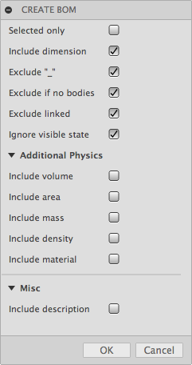

## CSV-BOM
Creates a bill of material from the browser components tree in Autodesk Fusion360.

### General Usage Instructions
After installation, go to the toolbar "Create" submenu and choose "Create BOM". A dialog appears which shows provided options to control the CSV output. Click OK and a save file dialog comes up. Name your file and click OK. After creating the file a message box popups with the information that the file has successfully created. Open a suitable app which can handle CSV formatted files. Import the CSV file and voila the BOM of your design is showing.

### Supportet options

* **Selected only**
> Means that only selected components will be exported to CSV.

* **Include dimension**
> Exports the accumulated bounding box dimension of all solid bodies on first level whithin a component.

* **Exclude "_"**
> Often users sign components with an underscore to make them visually for internal use. This option ignores such signed components.
> If you deselect this option another option comes up which is descripted next.

	* **Strip "_"**
>> You want underscore signed components too? No problem, but you dont want the underscore in the outputted component name? Then this option is right for you. It strippes the underscore away.

* **Exclude if no bodies**
> Components without a body makes no sense. Activate this option to ignore them.

* **Exclude linked**
> If linked components have there own BOM, you can exclude them to keep your BOM lean and clean.

* **Ignore visible state**
> The component is not visible but it should taken to the BOM? Ok, activate this option to do that.

### Supported physical options

* **Include volume**
> Includes the accumulated volume for all bodies at first level whithin a component.

* **Include area**
> Includes the accumulated area for all bodies at first level whithin a component.

* **Include mass**
> Includes the accumulated mass for all bodies at first level whithin a component.

* **Include density**
> Add's the density of the first body at first level found whithin a component.

* **Include material**
> Includes the material names as an comma seperated list for all bodies at first level whithin a component.

